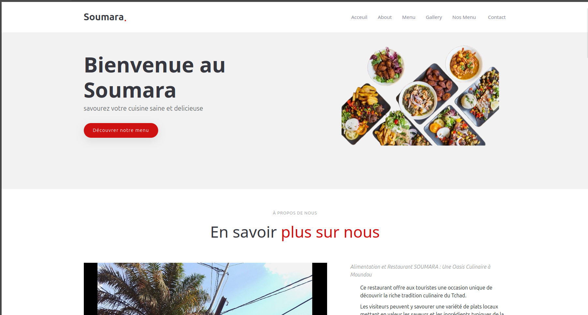
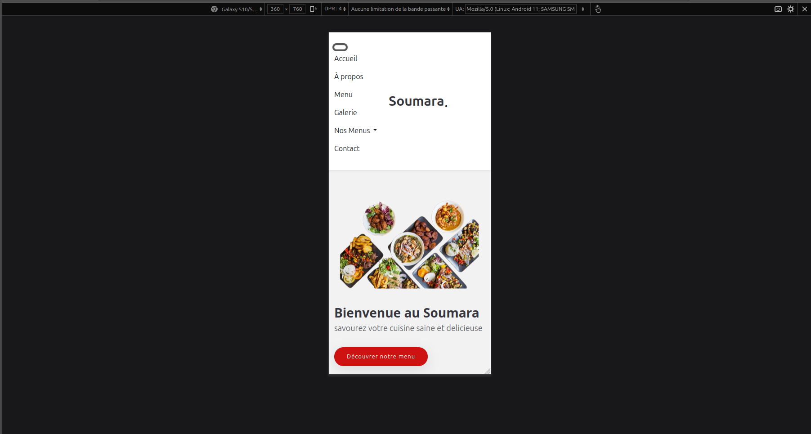

# Soumara – Site Vitrine Restaurant Libanais

  
  

## Description
Soumara est un restaurant libanais situé à Moundou, à côté du rond-point de la Femme. Le restaurant propose une expérience culinaire conviviale et chaleureuse avec des plats savoureux et authentiques.

## Fonctionnalités
- Design responsive (compatible mobile, tablette et ordinateur)  
- Navigation fluide avec un menu clair  
- Présentation du menu et des plats du restaurant  
- Galerie d’images des spécialités culinaires  
- Mise en avant des informations de contact  

## Technologies utilisées

- HTML5 – Structure du site

- CSS3 – Mise en forme personnalisée

- Bootstrap 5 – Framework responsive et design moderne

- J-avaScript – Interactions et animations


## Installation / Lancement
1. Cloner le projet :  
```bash
git clone https://github.com/Abdelkerim516/Soumara.git
